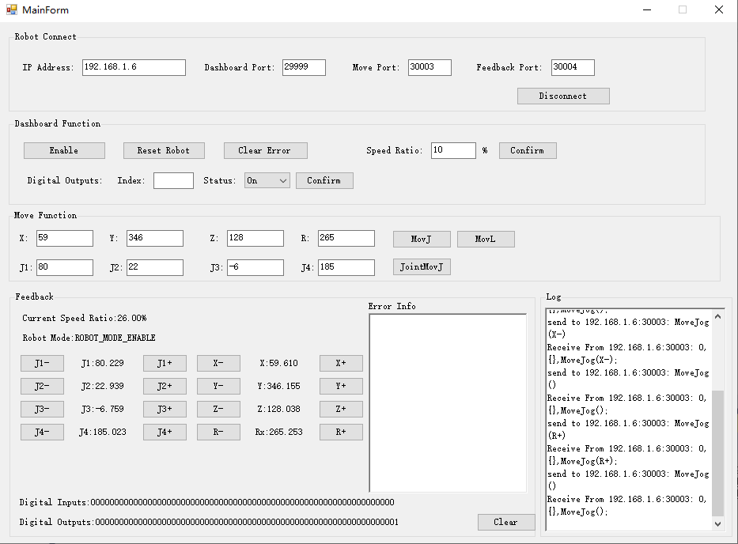

Chinese version of the README -> please [click here](./README.md)

### Run step
1. Requires .Net Framework 4.5 and above.
2. Open CSharpTcpDemo.sln with Visual Studio2017.
3. Just run the project.

### About version matching instructions
1. This Demo is applicable to V1.5.6.0 and above controller version of MG400/M1Pro series.

### About IP Ports
1. 30004 Only receive real-time feedback data.
2. 30003 Only send motion command data.
3. 29999 Set command data

